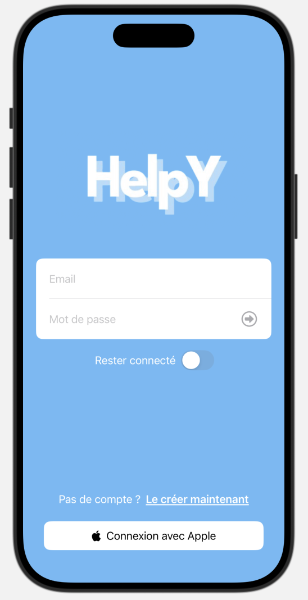
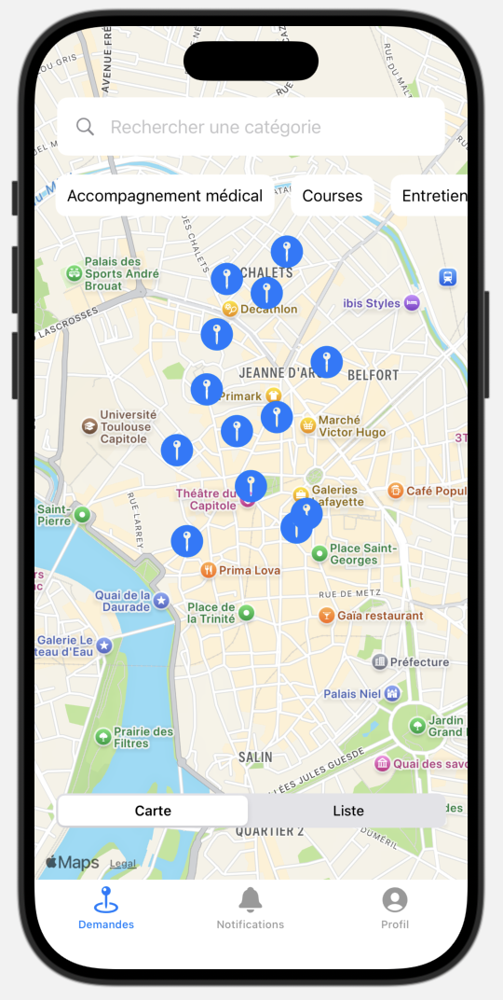
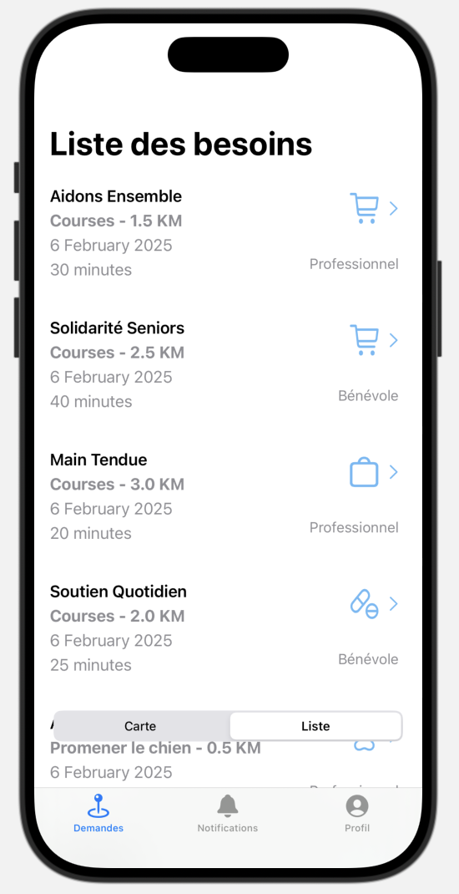
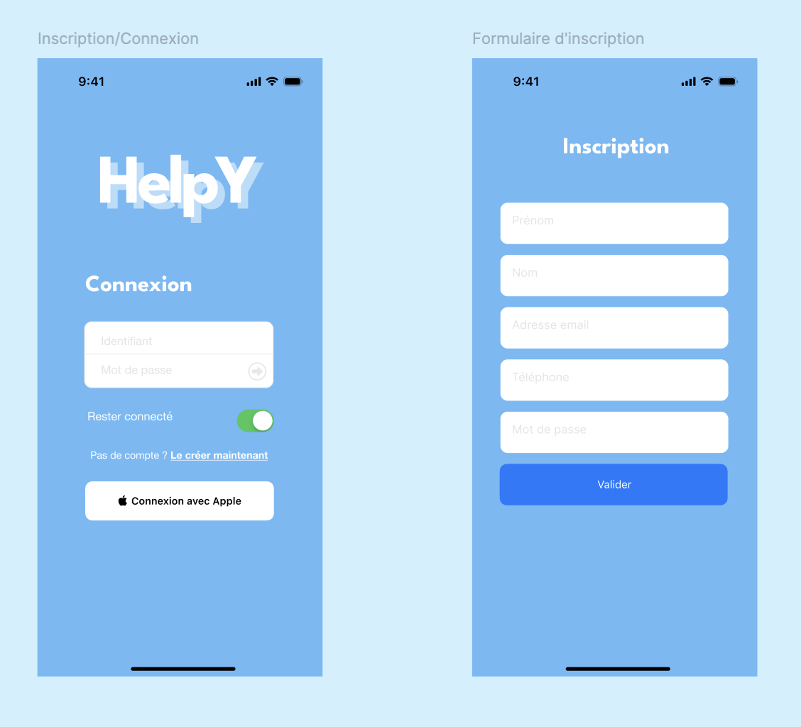
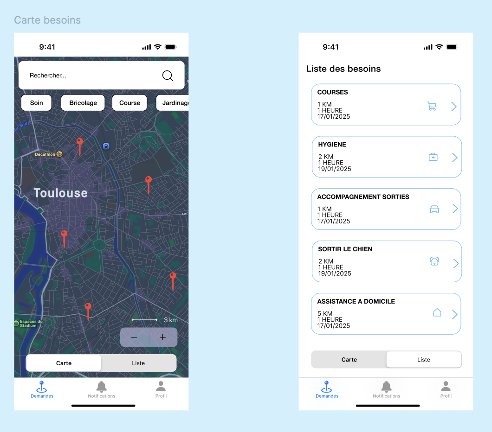
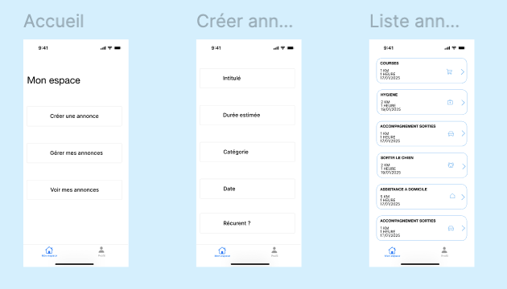

# 🤝 HelpY

**Application iOS d'entraide locale qui met en relation des prestataires (pros et bénévoles) avec des personnes ou structures qui ont besoin d'aide : courses, hygiène, sorties, assistance à domicile…**

## 📱 L'application

  
  &nbsp;
  
  &nbsp;
  

<i>Connexion · Carte des besoins autour de soi · Liste des besoins</i>

## 🎨 De la maquette au code

Le projet a d'abord été conçu sur Figma (wireframes puis maquettes), avant d'être développé en SwiftUI.

  
  &nbsp;
  

  

## 🔹 État actuel du développement

- ✅ Interface utilisateur finalisée avec SwiftUI, avec une navigation fluide et intuitive
- ✅ Système de connexion pour les prestataires et les partenaires
- ✅ Carte interactive (MapKit) et liste des besoins, avec filtres par catégorie
- ✅ Profil modifiable et notifications

## 🔹 Fonctionnalités prévues

- Affichage des demandes selon les disponibilités et compétences des prestataires
- Notifications pour alerter des nouvelles opportunités
- Chat intégré entre prestataires et établissements partenaires
- Géolocalisation pour proposer des missions proches

## 🛠️ Lancer le projet

1. Cloner le dépôt
2. Ouvrir `HelpY/HelpY.xcodeproj` dans Xcode
3. Lancer sur un simulateur iPhone (⌘R)

> Les données affichées (prestataires, demandes) sont fictives.
